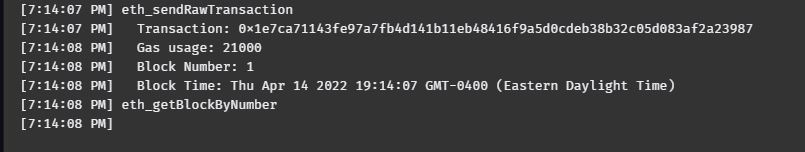

## Cryptocurrency Wallet

### Background

You work at a startup that is building a new and disruptive platform called Fintech Finder. Fintech Finder is an application that its customers can use to find fintech professionals from among a list of candidates, hire them, and pay them. As Fintech Finder’s lead developer, you have been tasked with integrating the Ethereum blockchain network into the application in order to enable your customers to instantly pay the fintech professionals whom they hire with cryptocurrency.

In this Challenge, you will complete the code that enables your customers to send cryptocurrency payments to fintech professionals. To develop the code and test it out, you will assume the perspective of a Fintech Finder customer who is using the application to find a fintech professional and pay them for their work.

### What You're Creating

The first file that you will use is called `fintech_finder.py`. It contains the code associated with the web interface of your application. The code included in this file is compatible with the Streamlit library. You will write all of your code for this Challenge in this file.

The second file that you will use is called `crypto_wallet.py`. This file contains the Ethereum transaction functions that you have created throughout this module’s lessons. By using import statements, you will integrate the `crypto_wallet.py` Python script into the Fintech Finder interface program that is found in the `fintech_finder.py` file.

Integrating these two files will allow you to automate the tasks associated with generating a digital wallet, accessing Ethereum account balances, and signing and sending transactions via a personal Ethereum blockchain called Ganache.

PLEASE NOTE: You should contain a .env file with your Ganache mnemonic.

### Application Testing

This is the application running prior to making the transaction.

Ganache prior to sending funds.

Transaction Hash from the application after sending the transaction.

This is showing Ganache log of the transaction.

Below is showing the Ganache history of the transaction.

Account Balance after Submission.

Account Transaction after Submission.

